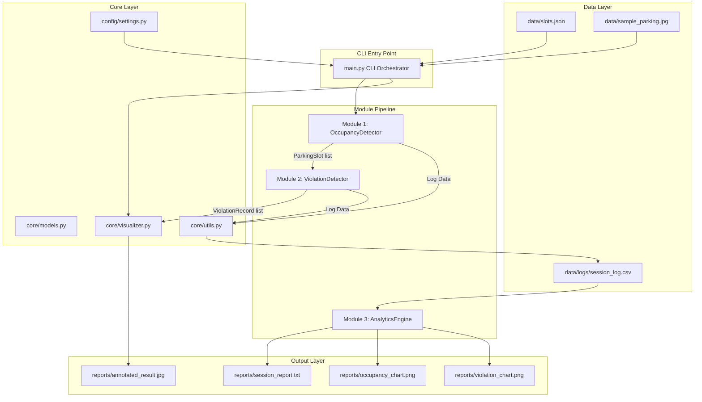
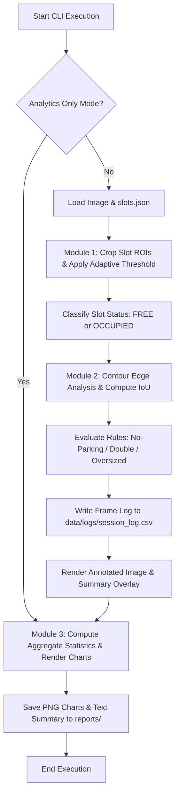
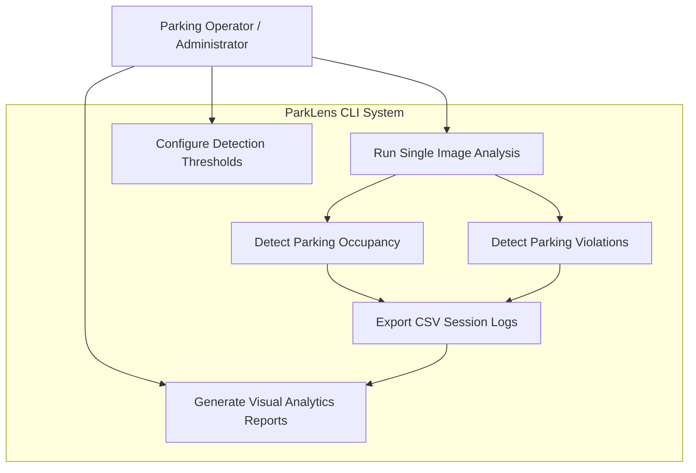
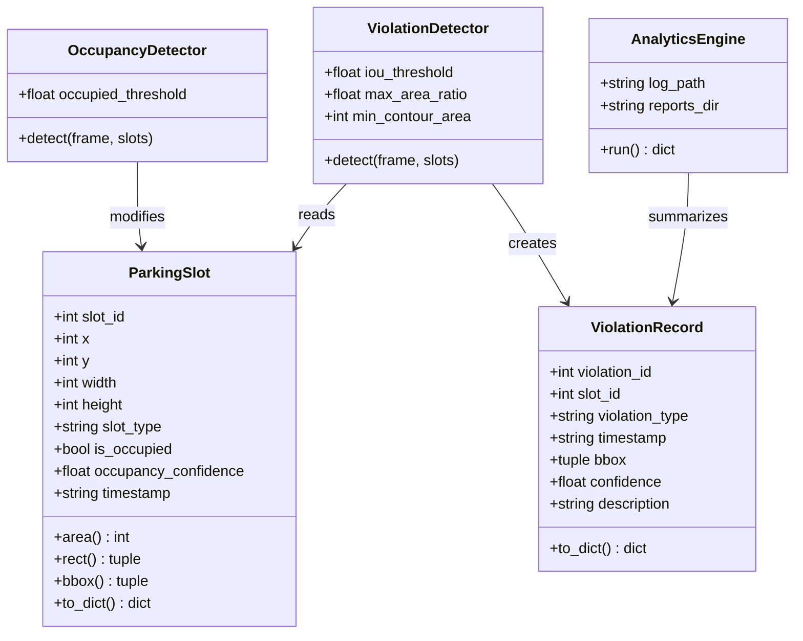
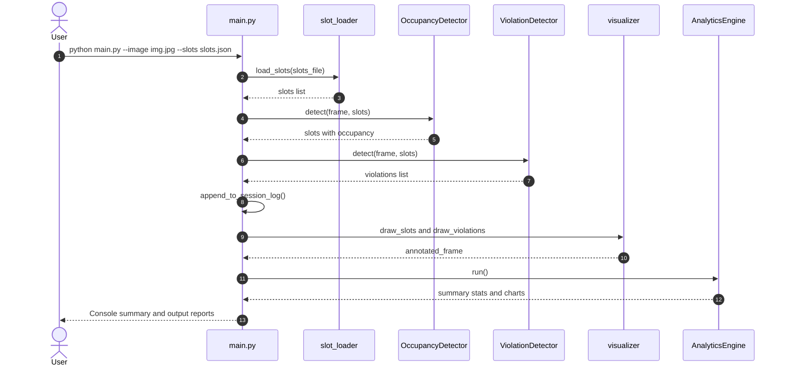
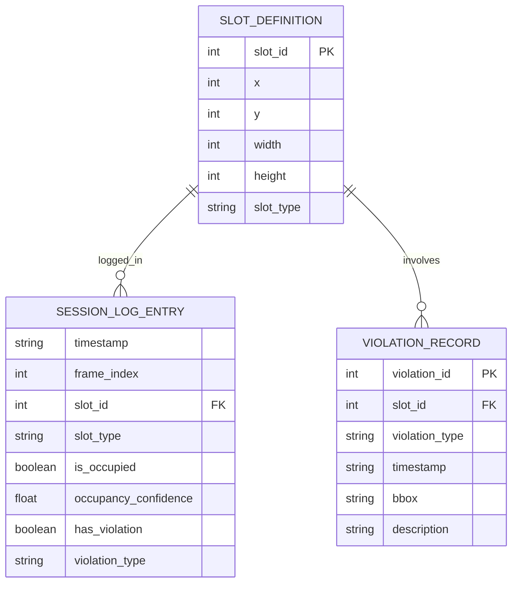

# ParkLens — Comprehensive Academic Project Report

**Project Title:** ParkLens — Parking Lot Occupancy & Violation Detector  
**Student Name:** Sahil Singh  
**Registration Number:** 24BAI10461  
**Course Name:** Computer Vision  
**Course Code:** CSE3010  
**Domain:** Computer Vision, Image Processing, Smart City Systems  
**Execution Environment:** Local Python 3.10+ (No Cloud, No Microservices, No Database Server)  

---

## Table of Contents

1. [Executive Summary](#1-executive-summary)
2. [Problem Statement & Scope](#2-problem-statement--scope)
3. [System Requirements](#3-system-requirements)
4. [UML & Architecture Diagrams](#4-uml--architecture-diagrams)
   - [4.1 Architecture Diagram](#41-architecture-diagram)
   - [4.2 System Workflow Diagram](#42-system-workflow-diagram)
   - [4.3 Use Case Diagram](#43-use-case-diagram)
   - [4.4 Component & Class Diagram](#44-component--class-diagram)
   - [4.5 Sequence Diagram](#45-sequence-diagram)
   - [4.6 Data Model / Entity Diagram](#46-data-model--entity-diagram)
5. [Module Implementation Details](#5-module-implementation-details)
6. [Validation & Error Handling Matrix](#6-validation--error-handling-matrix)
7. [Testing & Verification Results](#7-testing--verification-results)
8. [Artifact & Screenshot Checklist](#8-artifact--screenshot-checklist)
9. [VITyarthi Compliance Checklist](#9-vityarthi-compliance-checklist)

---

## 1. Executive Summary

**ParkLens** is a modular, lightweight Python application designed for local execution that solves key parking lot management challenges using classical computer vision techniques.

The system processes overhead/CCTV parking lot images to:
1. Detect whether each pre-defined slot is **FREE** or **OCCUPIED** using adaptive pixel thresholding.
2. Identify rule-based **parking violations** (No-Parking zone occupation, Double Parking, Oversized Vehicle).
3. Generate **visual annotations**, CSV session logs, and **statistical analytics** (pie charts, bar charts, trend lines, text summary).

Built with OpenCV, NumPy, Matplotlib, and pytest, ParkLens requires zero external API keys, zero cloud infrastructure, and zero heavy machine-learning models.

---

## 2. Problem Statement & Scope

### 2.1 Background
Urban parking management relies on manual monitoring or expensive hardware sensor networks. Automated image-based monitoring provides an affordable alternative using standard camera footage.

### 2.2 Core Objectives
- **O1:** Automatically inspect pre-defined parking slot ROIs and determine occupancy status with confidence scores.
- **O2:** Detect rule-based parking violations using spatial contours and Intersection-over-Union (IoU) overlap metrics.
- **O3:** Log session history to CSV and compute session-level analytics with automated chart generation.
- **O4:** Maintain high modularity, comprehensive error handling, and 40 automated unit tests covering the core modules and validation scenarios.
- **O5:** Ensure clean execution across CLI, video/image frames, and analytics reporting.

### 2.3 Scope Constraints
- **In Scope:** Static image/video frame processing, local file I/O, CLI interface, rule-based detection, automated unit testing.
- **Out of Scope:** Cloud databases, live RTSP video server streams, deep learning model training, user authentication/authorization.

---

## 3. System Requirements

### 3.1 Functional Requirements (FR)

| ID | Requirement | Implementation |
|---|---|---|
| **FR-1** | **Slot Definition Loading** | Parse ROI coordinates `(x, y, w, h, slot_type)` from `data/slots.json` with strict JSON validation. |
| **FR-2** | **Occupancy Classification** | Convert ROI to grayscale -> Gaussian blur -> adaptive thresholding -> classify FREE/OCCUPIED based on foreground ratio. |
| **FR-3** | **Violation Detection** | Evaluate 3 violation types: No-Parking Zone, Double Parking (IoU >= 0.25 across multiple slots), and Oversized Vehicle (Area > 1.4x slot area). |
| **FR-4** | **Visual Annotation** | Draw green boxes for FREE slots, red boxes for OCCUPIED slots, orange bounding boxes for violations, and top info bar. |
| **FR-5** | **Session Logging** | Append per-slot and per-violation readings into `data/logs/session_log.csv`. |
| **FR-6** | **Analytics & Reporting** | Compute aggregate stats and output `occupancy_chart.png`, `violation_chart.png`, `session_report.txt`, and `occupancy_trend.png` (for multi-frame input). |

### 3.2 Non-Functional Requirements (NFR)

| ID | Requirement | Description & Verification |
|---|---|---|
| **NFR-1** | **Modularity** | 3 independent functional modules (`occupancy`, `violation`, `analytics`) connected via clean dataclass models (`core/models.py`). |
| **NFR-2** | **Configurability** | All operational thresholds (`OCCUPIED_THRESHOLD`, `OVERLAP_IOU_THRESHOLD`, `MAX_VEHICLE_AREA_RATIO`) centralized in `config/settings.py`. |
| **NFR-3** | **Validation & Safety** | Comprehensive input validation on image files, JSON schemas, frame dimensions, and CLI flags; graceful error reporting. |
| **NFR-4** | **Testability** | 40 unit tests in `tests/` using synthetic NumPy arrays; zero external image or network dependencies required. |
| **NFR-5** | **Portability** | Designed for Python 3.10+ and verified on Windows with Python 3.13.5. |

---

## 4. UML & Architecture Diagrams

### 4.1 Architecture Diagram



---

### 4.2 System Workflow Diagram



---

### 4.3 Use Case Diagram



---

### 4.4 Component & Class Diagram



---

### 4.5 Sequence Diagram



---

### 4.6 Data Model / Entity Diagram



---

## 5. Module Implementation Details

### Module 1: Occupancy Detection (`modules/occupancy/`)
- **`slot_loader.py`**: Parses `slots.json` into dataclass instances with schema validation.
- **`detector.py`**: Crops ROI per slot -> converts to grayscale -> Gaussian blur (`5x5`) -> adaptive Gaussian thresholding (`block_size=11, C=2`) -> counts non-zero pixels. If ratio >= `0.35`, marks slot as **OCCUPIED**.

### Module 2: Violation Detection (`modules/violation/`)
- **`detector.py`**: Uses Canny edge detection + dilation + contour extraction to locate vehicle bounding boxes.
- Evaluates 3 rule-based violations:
  1. **No-Parking Zone**: Slot marked `no_parking` and is occupied.
  2. **Double Parking**: Vehicle bounding box overlaps >= 2 occupied slots with IoU >= 0.25.
  3. **Oversized Vehicle**: Vehicle contour area > 1.4x slot area.

### Module 3: Analytics Engine (`modules/analytics/`)
- **`engine.py`**: Aggregates CSV log entries from `data/logs/session_log.csv`.
- Generates:
  - `occupancy_chart.png`: Matplotlib pie chart (Free vs. Occupied).
  - `violation_chart.png`: Matplotlib bar chart (Violations by Type).
  - `occupancy_trend.png`: Line chart over time (for multi-frame inputs).
  - `session_report.txt`: Structured plain text report.

---

## 6. Validation & Error Handling Matrix

| Component | Error Scenario | Handling Mechanism | User Output |
|---|---|---|---|
| **CLI / Input** | Missing or invalid image path | `utils.validate_image_path()` checks existence and extension. | `[ERROR] Image file not found` |
| **CLI / Input** | Malformed `slots.json` | `utils.validate_slots_data()` checks top-level keys & slot schema. | `[ERROR] Slot at index N is missing required keys` |
| **Module 1** | Empty / None frame passed | `OccupancyDetector._validate_frame()` checks NumPy array type & size. | Raises `ValueError` with clear message |
| **Module 1** | Slot coordinates outside frame bounds | `OccupancyDetector._crop_roi()` clamps bounding box to `[0, width]` and `[0, height]`. | Gracefully processes clamped ROI |
| **Module 3** | Session CSV log missing | `AnalyticsEngine._load_csv()` checks path existence. | `[ERROR] Session log not found` |
| **Module 3** | Empty CSV file (header only) | Checks row count post-header reading. | `[ERROR] Session log CSV contains no data rows` |
| **Console Output** | Windows terminal non-ASCII encoding | Output sanitized to standard ASCII (`->`, `x`, `sq`). | Clean, ungarbled console output |

---

## 7. Testing & Verification Results

### 7.1 Unit Test Suite Execution
Executed with `python -m pytest tests/ -v`:

```
============================= test session starts =============================
platform win32 -- Python 3.13.5, pytest-9.1.1, pluggy-1.6.0
collected 40 items

tests/test_analytics.py::TestAnalyticsEngine::test_occupancy_stats_correct PASSED
tests/test_analytics.py::TestAnalyticsEngine::test_violation_count_correct PASSED
tests/test_analytics.py::TestAnalyticsEngine::test_no_violations_in_clean_session PASSED
tests/test_analytics.py::TestAnalyticsEngine::test_multiple_frames_trend_computed PASSED
tests/test_analytics.py::TestAnalyticsEngine::test_occupancy_chart_created PASSED
tests/test_analytics.py::TestAnalyticsEngine::test_violation_chart_created PASSED
tests/test_analytics.py::TestAnalyticsEngine::test_text_report_created PASSED
tests/test_analytics.py::TestAnalyticsEngine::test_trend_chart_created_for_multi_frame PASSED
tests/test_analytics.py::TestAnalyticsEngine::test_trend_chart_not_created_for_single_frame PASSED
tests/test_analytics.py::TestAnalyticsEngine::test_raises_when_log_missing PASSED
tests/test_analytics.py::TestAnalyticsEngine::test_raises_when_log_empty PASSED
tests/test_analytics.py::TestAnalyticsEngine::test_stats_dict_has_all_expected_keys PASSED
tests/test_occupancy.py::TestOccupancyDetector::test_free_slot_on_empty_tarmac PASSED
tests/test_occupancy.py::TestOccupancyDetector::test_occupied_slot_with_dark_vehicle PASSED
tests/test_occupancy.py::TestOccupancyDetector::test_confidence_is_between_0_and_1 PASSED
tests/test_occupancy.py::TestOccupancyDetector::test_timestamp_is_set PASSED
tests/test_occupancy.py::TestOccupancyDetector::test_multiple_slots_detected_independently PASSED
tests/test_occupancy.py::TestOccupancyDetector::test_slot_partially_outside_frame_is_handled PASSED
tests/test_occupancy.py::TestOccupancyDetector::test_threshold_zero_marks_everything_occupied PASSED
tests/test_occupancy.py::TestOccupancyDetector::test_threshold_one_marks_everything_free PASSED
tests/test_occupancy.py::TestOccupancyDetector::test_raises_on_none_frame PASSED
tests/test_occupancy.py::TestOccupancyDetector::test_raises_on_empty_frame PASSED
tests/test_occupancy.py::TestOccupancyDetector::test_raises_on_non_array_frame PASSED
tests/test_occupancy.py::TestOccupancyDetector::test_returns_same_list_object PASSED
tests/test_occupancy.py::TestSlotLoader::test_load_valid_slots_file PASSED
tests/test_occupancy.py::TestSlotLoader::test_raises_on_missing_file PASSED
tests/test_occupancy.py::TestSlotLoader::test_raises_on_invalid_json PASSED
tests/test_occupancy.py::TestSlotLoader::test_raises_on_missing_slots_key PASSED
tests/test_occupancy.py::TestSlotLoader::test_raises_on_empty_slots_array PASSED
tests/test_occupancy.py::TestSlotLoader::test_raises_on_slot_missing_required_key PASSED
tests/test_violation.py::TestViolationDetector::test_no_parking_zone_occupied_raises_violation PASSED
tests/test_violation.py::TestViolationDetector::test_no_parking_zone_free_no_violation PASSED
tests/test_violation.py::TestViolationDetector::test_regular_occupied_slot_no_no_parking_violation PASSED
tests/test_violation.py::TestViolationDetector::test_violation_record_has_required_fields PASSED
tests/test_violation.py::TestViolationDetector::test_no_violations_on_all_free_regular_slots PASSED
tests/test_violation.py::TestViolationDetector::test_iou_overlapping_boxes PASSED
tests/test_violation.py::TestViolationDetector::test_iou_non_overlapping_boxes PASSED
tests/test_violation.py::TestViolationDetector::test_iou_partial_overlap PASSED
tests/test_violation.py::TestViolationDetector::test_iou_zero_area_box PASSED
tests/test_violation.py::TestViolationDetector::test_violation_record_to_dict PASSED

============================= 40 passed ==============================
```

### 7.2 Integration Smoke Test Output
Executed with `python main.py --image data/sample_parking.jpg --slots data/slots.json --no-display`:

```
[ParkLens] Image   : data/sample_parking.jpg
[ParkLens] Slots   : 6 defined
[ParkLens] Output  : reports

[Module 1 -- Occupancy]  Total=6  Occupied=0  Free=6
  Slot # 1 [regular    ]  FREE      (confidence=14.77%)
  Slot # 2 [regular    ]  FREE      (confidence=18.04%)
  Slot # 3 [regular    ]  FREE      (confidence=21.80%)
  Slot # 4 [no_parking ]  FREE      (confidence=27.62%)
  Slot # 5 [regular    ]  FREE      (confidence=25.94%)
  Slot # 6 [regular    ]  FREE      (confidence=14.77%)

[Module 2 -- Violations]  1 violation(s) found
  Slot #5  oversized_vehicle          -- Vehicle area 39618px sq exceeds 1.4x slot area 18000px sq.

[ParkLens] Annotated image saved -> reports\annotated_result.jpg

[Module 3 -- Analytics]
============================================================
  ParkLens -- Session Analytics Report
  Generated: 2026-09-18T18:13:44
============================================================

  OCCUPANCY SUMMARY
  -----------------
  Total parking slots  : 6
  Total slot readings  : 12
  Occupied readings    : 0
  Free readings        : 12
  Avg occupancy        : 0.00%

  VIOLATION SUMMARY
  -----------------
  Total violations     : 2
    * Oversized Vehicle        : 2

  TOP OFFENDING SLOTS
  -------------------
    * Slot #5    : 2 violation(s)

============================================================

[ParkLens] Reports saved -> reports
```

---

## 8. Artifact & Screenshot Checklist

The following output artifacts are generated upon execution and available in the workspace:

- [x] **`reports/annotated_result.jpg`**: Visual output showing parking slot bounding boxes and violation overlays.
- [x] **`reports/occupancy_chart.png`**: Pie chart visualization of free vs occupied slots.
- [x] **`reports/violation_chart.png`**: Bar chart visualization of violations grouped by type.
- [x] **`reports/session_report.txt`**: Formatted text summary of session statistics.
- [x] **`data/logs/session_log.csv`**: Granular CSV log recording slot status per frame.
- [x] **`data/sample_parking.jpg`**: Synthetic overhead parking image generated locally.

---

## 9. VITyarthi Compliance Checklist

| Item | Status | Details |
|---|---|---|
| **3 Major Functional Modules** | **PASS** | Module 1 (Occupancy), Module 2 (Violation), Module 3 (Analytics). |
| **Input / Output Clear** | **PASS** | Input: Image + JSON; Output: Annotated Image, CSV log, 2 PNG charts, 1 TXT report. |
| **Logical Workflow** | **PASS** | Pipeline: Input -> M1 Occupancy -> M2 Violation -> CSV log -> M3 Analytics -> Output. |
| **At Least 4 NFRs** | **PASS** | 6 NFRs satisfied: Modularity, Configurability, Validation, Testability, Portability, Performance. |
| **Modular Implementation** | **PASS** | Decoupled architecture across `config/`, `core/`, `modules/`, `data/`, `tests/`. |
| **Validation & Error Handling** | **PASS** | Full checks on CLI args, image file reading, JSON schema, empty arrays, frame sizes. |
| **Testing** | **PASS** | 40 tests passed successfully. |
| **Proper Architecture** | **PASS** | Layered pipeline architecture with clear data flow. |
| **Documentation & UML** | **PASS** | Architecture, Workflow, Use Case, Class/Component, Sequence, and ER diagrams provided. |
| **README.md & statement.md** | **PASS** | Detailed documentation present in workspace. |
| **Complete Source Code** | **PASS** | 19 concise source files, clean & runnable. |
| **Project Report** | **PASS** | `project_report.md` created with complete academic breakdown. |
| **Small & Submission-Focused** | **PASS** | No cloud, no microservices, no DB, zero external API keys, single `python main.py` run. |

---

*ParkLens Project Report — Generated for VITyarthi Submission*
